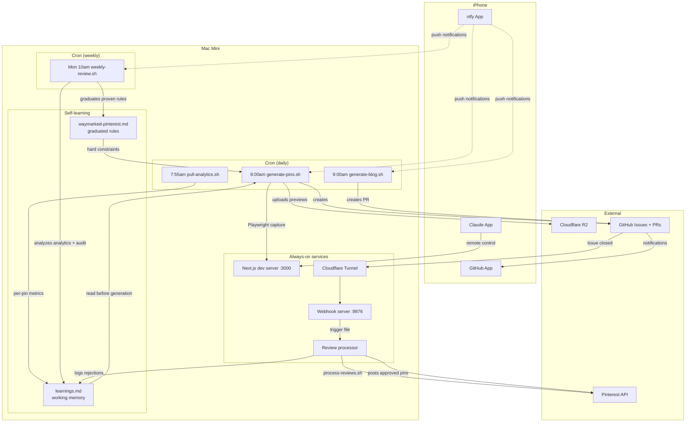

# Waymarked Pinterest Automation

Hands-off Pinterest + blog marketing system running on Trent's Mac Mini. Generates pins and blog posts daily, learns from feedback and Pinterest analytics, posts approved pins automatically.

## How It Works



## Schedule

```
         7:55am           8am              9am              10am
Mon  [analytics]   [3 pinterest pins]   [blog draft]   [weekly review]
Tue  [analytics]   [3 pinterest pins]   [blog draft]
Wed  [analytics]   [3 pinterest pins]   [blog draft]
Thu  [analytics]   [3 pinterest pins]   [blog draft]
Fri  [analytics]   [3 pinterest pins]   [blog draft]
Sat  [analytics]   [3 pinterest pins]   [blog draft]
Sun  [analytics]   [3 pinterest pins]   [blog draft]

+ Event-driven: GitHub Issue closed → webhook → process reviews → post to Pinterest
```

### Crontab

```cron
55 7 * * * /bin/bash ~/waymarked-pinterest/pull-analytics.sh
0 8 * * * /bin/bash ~/waymarked-pinterest/generate-pins.sh
0 9 * * * /bin/bash ~/waymarked-pinterest/generate-blog.sh
0 10 * * 1 /bin/bash ~/waymarked-pinterest/weekly-review.sh
```

## Self-Learning System

Two-layer memory that learns from both your taste and Pinterest's algorithm:

### Layer 1: Working Memory (`learnings.md`)

Recent observations, raw data, and experiments. Tracks **combinations** (style x destination-type, angle x region) rather than single variables. A style isn't good or bad on its own — it depends on what it's paired with.

Updated by:
- **process-reviews.sh** — logs rejections with combo attribution
- **weekly-review.sh** — adds analytics-driven combo insights

### Layer 2: Permanent Memory (Graduated Rules in `waymarked-pinterest.md`)

Proven patterns with 3+ data points confirmed by analytics. The weekly review graduates rules from learnings.md and prunes the source data to keep working memory lean.

### Learning Signals

| Signal | Source | What it teaches |
|--------|--------|----------------|
| Your approval/rejection | GitHub Issue comments | "I don't like how this looks" (taste) |
| Rejection reasons | GitHub Issue comments | "This combo doesn't work because..." (combo learning) |
| Per-pin impressions | Pinterest API | "Pinterest users see this pin" (distribution) |
| Per-pin saves/clicks | Pinterest API | "Pinterest users engage with this pin" (quality) |
| Outbound clicks | Pinterest API | "People click through to waymarked.com" (conversion) |

### Smart Linking

Pin descriptions link to relevant blog posts instead of the homepage. Before generating, Claude scans `~/repos/waymarked/content/blog/*.mdx` and matches by angle/category:
- Gift-angle pins → gift guide blog post
- Honeymoon pins → honeymoon gifts blog post
- No match → waymarked.com/create

This creates backlinks to blog posts, improving SEO.

## Scripts

All scripts live in `~/waymarked-pinterest/` and follow the same pattern: set PATH, log to `cron.log`, run `claude --dangerously-skip-permissions -p`, extract `SUMMARY:` line, send ntfy notification.

| Script | Model | Reads | Writes | Notification |
|--------|-------|-------|--------|-------------|
| `pull-analytics.sh` | none (curl) | `.pinterest-token`, `audit.json` | `analytics/YYYY-MM-DD.json`, `analytics/pin-metrics.json` | None |
| `generate-pins.sh` | sonnet | learnings.md, audit.json, skill file, blog posts | audit.json, exports/, pending-review.md, GitHub Issue | Clickable link to Issue |
| `generate-blog.sh` | sonnet | learnings.md, blog directory, skill file | `content/blog/SLUG.mdx`, git branch + PR | Clickable link to PR |
| `weekly-review.sh` | sonnet | pin-metrics.json, audit.json, learnings.md, skill file | learnings.md (insights), skill file (graduated rules) | Insight summary |
| `process-reviews.sh` | sonnet | GitHub Issues, audit.json, learnings.md, skill file | audit.json, learnings.md, posts to Pinterest | Approval summary |

### Supporting Scripts

| Script | Purpose |
|--------|---------|
| `ntfy-notify.sh` | Claude Code hook handler for idle/done notifications |
| `webhook-server.mjs` | GitHub webhook receiver (port 9876), verifies HMAC, writes trigger file |
| `upload-to-r2.mjs` | Uploads pin preview JPEGs to Cloudflare R2 for GitHub Issue embeds |

## Always-On Services (launchd)

Plists in `~/Library/LaunchAgents/com.waymarked.*.plist`. All have `KeepAlive: true` and `RunAtLoad: true`.

| Service | Plist | What |
|---------|-------|------|
| Dev server | `com.waymarked.devserver` | Next.js at localhost:3000 for Playwright map capture |
| Cloudflare Tunnel | `com.waymarked.tunnel` | Routes webhook.waymarked.com → localhost:9876 |
| Webhook server | `com.waymarked.webhook` | Node.js server receiving GitHub webhook events |
| Review processor | `com.waymarked.process-reviews` | WatchPaths on `~/.run-reviews`, runs process-reviews.sh |

### Webhook Flow

```
GitHub Issue closed
  → webhook POST to webhook.waymarked.com
  → Cloudflare Tunnel → localhost:9876
  → webhook-server.mjs verifies signature, waits 10s
  → writes ~/.run-reviews trigger file
  → launchd WatchPaths → process-reviews.sh
  → Claude posts approved pins, logs rejections
  → comments on Issue, sends ntfy notification
```

## File Structure

```
~/waymarked-pinterest/
├── README.md                     # This file (source of truth)
├── waymarked-pinterest.md        # Skill file (generation rules, graduated rules, posting flow)
├── learnings.md                  # Working memory (combo observations, rejection log, experiments)
├── audit.json                    # Every pin generation (status, attributes, Pinterest URL)
├── pending-review.md             # Current pins awaiting review
├── .pinterest-token              # Access token (expires every 30 days)
├── .pinterest-refresh-token      # Refresh token (60 days)
├── .pinterest-boards.json        # Board name → ID mapping (8 boards)
├── .env                          # WEBHOOK_SECRET, PINTEREST_APP_ID, PINTEREST_APP_SECRET, NTFY_TOPIC
├── analytics/
│   ├── YYYY-MM-DD.json           # Daily account-level metrics
│   └── pin-metrics.json          # Per-pin rolling metrics (last 8 weekly snapshots)
├── exports/
│   └── gen_XXX.png               # Generated map images
├── generate-pins.sh              # Daily: generate 3 pins
├── generate-blog.sh              # Daily: draft a blog post
├── pull-analytics.sh             # Daily: pull account + per-pin analytics
├── weekly-review.sh              # Monday: analyze, graduate rules, prune
├── process-reviews.sh            # Webhook: process closed pin review Issues
├── ntfy-notify.sh                # Claude Code hook handler
├── webhook-server.mjs            # GitHub webhook receiver
└── upload-to-r2.mjs              # Cloudflare R2 uploader
```

**Gitignored:** `.env`, `.pinterest-token`, `.pinterest-refresh-token`, `exports/`, `analytics/`, `*.log`, `.run-reviews`, `processed-issues.txt`, `.claude/`

## Review Flow (from phone)

1. Phone buzzes with ntfy ("3 new pins ready" / "Blog draft ready")
2. Tap notification → opens GitHub Issue or PR
3. Comment on the Issue/PR:
   - **"approve all"** → posts all pins to Pinterest
   - **"approve 1 and 3, reject 2 — too dark for tropical"** → mixed actions, logs rejection reason
   - Merge PR → Vercel deploys blog post
4. Close the Issue → webhook triggers processing automatically

## Notifications

| Source | ntfy Title | Example |
|--------|-----------|---------|
| generate-pins.sh | "3 new pins ready" | Paris (watercolor), Tokyo (vintage) — tap to review |
| generate-blog.sh | "Blog draft ready" | Best Travel Gifts 2026 — tap to review PR |
| weekly-review.sh | "Weekly review done" | 3 insights updated, 1 rule graduated, top pin: gen_015 Thailand (3 imp) |
| process-reviews.sh | "Reviews processed" | 2 approved, 1 rejected, 2 posted |
| Claude hooks | "Waymarked" | Waiting for you / Task done |

Topic: `$NTFY_TOPIC` — test with `curl -s -d "test" ntfy.sh/$NTFY_TOPIC`

## Mac Mini

- **Host:** trentons-mini.lan / 192.168.86.25
- **SSH:** `ssh -i ~/.ssh/id_ed25519 trent@192.168.86.25`
- **Claude Code:** Max plan, tkmorrell6@gmail.com
- **tmux session:** `waymarked` (Win 0: dev server, Win 1: claude, Win 2: logs)
- **Startup:** `~/start-waymarked.sh`
- **Sleep disabled:** `sudo pmset -a sleep 0 displaysleep 0 autorestart 1`

## Token Refresh

Pinterest access token expires every 30 days. The skill file has auto-refresh logic using the app credentials stored in `.env`. If the refresh token itself expires (60 days), re-authorize via OAuth:

1. Open: `https://www.pinterest.com/oauth/?client_id=1545073&redirect_uri=https://localhost/&response_type=code&scope=user_accounts:read,pins:read,pins:write,boards:read`
2. Copy the `code=` from the redirect URL
3. Exchange: `curl -X POST https://api.pinterest.com/v5/oauth/token -H "Content-Type: application/x-www-form-urlencoded" -u "APP_ID:APP_SECRET" -d "grant_type=authorization_code&code=CODE&redirect_uri=https://localhost/"`
4. Save new tokens to `.pinterest-token` and `.pinterest-refresh-token`

## Troubleshooting

| Problem | Check |
|---------|-------|
| Cron not running | `sudo launchctl list \| grep cron`, then `tail -50 cron.log` |
| Pin generation failing | `curl -s http://localhost:3000` (dev server), `npx playwright install chromium` |
| Blog generation failing | `cd ~/repos/waymarked && git status` (clean state?), `git branch \| grep draft/` (leftover branches?) |
| Webhook not processing | `tail tunnel.log`, `tail webhook.log`, `tail process-reviews.log` |
| Analytics errors | Check for 401 in JSON output → token expired |
| No notifications | `curl -s -d "test" ntfy.sh/$NTFY_TOPIC`, check ntfy app subscription |
| Services not starting | `launchctl list \| grep waymarked`, reload with `launchctl unload/load` |

## Decisions

| Decision | Why |
|----------|-----|
| Combo-based learning over single-variable | A style isn't bad — it might just be bad with a specific destination type |
| Two-layer memory (learnings.md + skill file) | Working memory stays lean, proven rules are permanent |
| Sonnet for weekly review (not haiku) | Needs to cross-reference per-pin analytics with pin attributes |
| Per-pin analytics over account-level only | Need to know which specific pins drive engagement |
| Smart linking to blog posts | Backlinks improve SEO, outbound clicks are trackable |
| Private GitHub repo | Version control, change history, collaboration |
| ntfy over other notification services | Free, one curl command, no account needed |
| MDX blog over CMS | Claude writes a file, zero operational overhead, content in git |
| launchd over cron for services | Auto-restart on crash, WatchPaths for file-triggered events |
| GitHub Issues for pin review | Mobile-friendly, supports images, webhook integration |
